<div align="center">

  <!-- Header Dynamic Wave Banner -->
  

  <!-- Animated Dynamic Typing SVG -->
  <p align="center">
    <a href="https://github.com/aksoo10">
      
    </a>
  </p>

  <!-- Quick Highlight Badges -->
  <p align="center">
    
    &nbsp;
    
    &nbsp;
    
    &nbsp;
    
  </p>

</div>

---

### 👨‍💻 About Me

Halo! Saya **Agung Aksa**, seorang **Web Developer** dan Alumni dari **Universitas Sriwijaya (Fakultas Ilmu Komputer, Program Studi Manajemen Informatika)**. Saat ini berdomisili di Dusun III Desa Bailangu Timur, Kec. Sekayu, Kab. Musi Banyuasin, Sumatera Selatan.

Dengan latar belakang akademik di bidang Manajemen Informatika serta passion yang kuat pada rekayasa perangkat lunak, saya berfokus mengembangkan aplikasi web modern yang andal, efisien, dan ramah pengguna. Keahlian utama saya berpusat pada ekosistem **PHP & Laravel** untuk arsitektur backend, dipadukan dengan **Tailwind CSS** untuk antarmuka yang responsif dan estetis.

> 💡 *"Kualitas aplikasi tidak hanya dinilai dari tampilannya, melainkan dari kerapian struktur kode, keandalan logika bisnis, serta kemudahan dalam pemeliharaan jangka panjang (maintainability)."*

---

### 🏛️ Nilai Rekayasa & Fokus Utama

<table>
  <tr>
    <td width="50%" valign="top">
      <h4>🏗️ Clean Architecture & Scalability</h4>
      <ul>
        <li><b>Terstruktur & Rapi:</b> Menjaga controller tetap ramping dengan mengimplementasikan <i>Service Layer</i>, <i>Form Requests</i> untuk validasi, serta pemisahan logika bisnis yang jelas.</li>
        <li><b>Manajemen Basis Data:</b> Desain skema relasional terstruktur (MySQL), pemanfaatan migrasi, seeder, serta optimasi query Eloquent untuk efisiensi performa.</li>
      </ul>
    </td>
    <td width="50%" valign="top">
      <h4>🎨 Modern UI/UX & Fungsionalitas</h4>
      <ul>
        <li><b>Responsive & Intuitive:</b> Merancang dashboard admin dan layout web interaktif yang mobile-friendly menggunakan utility-first workflow dari <i>Tailwind CSS</i>.</li>
        <li><b>Integritas & Keamanan Data:</b> Menerapkan praktik keamanan web standar (Sanctum Auth, CSRF protection, hashing, mitigasi SQL Injection).</li>
      </ul>
    </td>
  </tr>
</table>

---

### 🛠️ Tech Stack & Ekosistem

<div align="center">

  <!-- Interactive Skill Icons Row -->
  <a href="https://skillicons.dev">
    
  </a>

</div>

<br />

<details open>
<summary><b>🔍 Rincian Teknologi & Peralatan Kerja</b></summary>
<br />

| Pilar | Teknologi & Badges |
| :--- | :--- |
| **Backend & Logika** |     |
| **Frontend & UI/UX** |      |
| **Database & ORM** |   |
| **Tools & Environment** |        |

</details>

---

### 💻 Proyek yang Gemar Saya Kembangkan

```yaml
fokus_pengembangan:
  aplikasi_manajemen_crud:
    deskripsi: "Sistem informasi dan CRUD komprehensif dengan validasi data bertingkat, relasi multi-tabel, dan pelaporan."
    keunggulan: ["Form Request Validation", "Eloquent Relationships", "Clean Error Handling"]

  admin_dashboards:
    deskripsi: "Panel kendali terpusat untuk monitoring data, manajemen pengguna (RBAC), dan visualisasi statistik."
    keunggulan: ["Role-Based Access Control", "Tailwind UI", "Tabel Data Responsif"]

  layanan_api:
    deskripsi: "Penyediaan endpoint RESTful API terstruktur untuk integrasi aplikasi client-side maupun mobile."
    keunggulan: ["API Resource Transformers", "Token-Based Authentication (Sanctum)", "Standarisasi Format JSON"]
```

---

### 🗺️ Learning & Development Roadmap

- [x] **Alumni Pendidikan Manajemen Informatika:** Pemahaman fondasi sistem informasi, basis data relasional, dan algoritma.
- [x] **Laravel Framework Core:** Routing, Blade Templating, Migrations, Seeders, Eloquent ORM, dan MVC Architecture.
- [x] **Modern UI Workflow:** Tailwind CSS utility-first layouting, responsive components, dan clean aesthetics.
- [🔄] **Arsitektur Lanjutan Laravel:** Menerapkan *Service & Repository Pattern*, Custom Middleware, dan Policies.
- [🔄] **REST API & Keamanan:** Penguatan keamanan endpoint web, autentikasi token, dan dokumentasi API (Postman).
- [⏳] **DevOps & Testing:** Unit/Feature Testing (Pest / PHPUnit), integrasi CI/CD, dan containerization dengan Docker.

---

### 🐍 GitHub Contribution Snake Game

<div align="center">

  <!-- Animasi Game Ular Memakan Titik Kontribusi (Otomatis adaptif mode terang & gelap) -->
  <picture>
    <source media="(prefers-color-scheme: dark)" srcset="./assets/github-contribution-grid-snake-dark.svg" />
    <source media="(prefers-color-scheme: light)" srcset="./assets/github-contribution-grid-snake.svg" />
    
  </picture>

  <br /><br />

  <table border="0">
    <tr>
      <td>
        
      </td>
      <td>
        
      </td>
    </tr>
  </table>

</div>

---

### 📫 Kontak & Terhubung Bersama Saya

<div align="center">

  <a href="https://github.com/aksoo10" target="_blank">
    
  </a>
  &nbsp;
  <a href="https://linkedin.com/in/" target="_blank">
    
  </a>
  &nbsp;
  <a href="mailto:agungaksa@example.com" target="_blank">
    
  </a>

</div>

<br />

<div align="center">

  <!-- Footer Banner -->
  

  <sub>⭐ <i>"Dedikasi, konsistensi, dan pembelajaran tiada henti adalah kunci membangun teknologi yang bermanfaat."</i> — Agung Aksa</sub>

</div>
